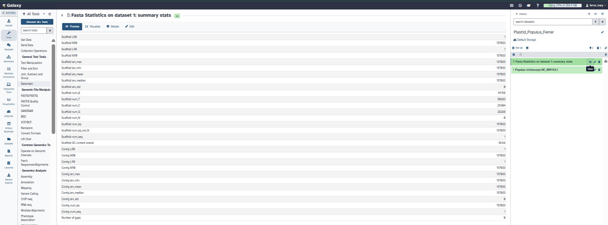

# Characterization of a Plastid Genome: *Populus trichocarpa*

**Student:** Mary Rose V. Ferrer

**Course/Section:** Cell and Molecular Biology - B

**Species:** *Populus trichocarpa* (black cottonwood), family Salicaceae

**NCBI accession/version:** NC_009143.1 (RefSeq)

**Source:** https://www.ncbi.nlm.nih.gov/nuccore/NC_009143.1

**Date retrieved:** October 1, 2026

## Plastome summary

Circular plastid genome of 157,033 bp with 36.68% GC content. It has the typical LSC-IR-SSC-IR arrangement.

| Region | Coordinates | Size | GC content |
|---|---|---|---|
| LSC | 1..85,129 | 85,129 bp | 34.47% |
| IRb | 85,130..112,781 | 27,652 bp | 41.92% |
| SSC | 112,782..129,381 | 16,600 bp | 30.54% |
| IRa | 129,382..157,033 | 27,652 bp | 41.92% |

The region sizes add up to the full genome (85,129 + 27,652 + 16,600 + 27,652 = 157,033 bp). The IR coordinates come from the two `repeat_region` entries in the GenBank record.

## How the genome was obtained

I searched NCBI Nucleotide for the *Populus* chloroplast complete genome and chose the RefSeq record NC_009143.1 for *Populus trichocarpa*. I checked that it is a complete circular genome and not a barcode gene or a fragment. The FASTA file and the annotated GenBank file were downloaded from the record page. The FASTA file was then uploaded to my own account at usegalaxy.org, where it was detected as fasta.

**Galaxy history:** Plastid_Populus_Ferrer

**Tools used:** Fasta Statistics

**Galaxy result:** 157,033 bp, 1 sequence record, GC content 36.68%, 0 N bases and 0 gaps (A 49,158; T 50,283; C 29,304; G 28,288). The whole plastome is in a single record.

## Gene content and observations

The GenBank annotation lists 144 gene features (98 CDS, 37 tRNA, 8 rRNA and 1 pseudogene, *infA*), counting genes in the IR twice. Counting each IR copy once gives 120 unique genes. The four rRNA genes (16S, 23S, 4.5S and 5S) occur in both IR copies. Genes with introns include *atpF*, *clpP*, *ndhA*, *ndhB*, *petB*, *petD*, *rpl16*, *rpl2*, *rpoC1*, *rps12* and *ycf3*, and six tRNA genes also have introns. *rps12* is trans-spliced, with its first exon in the LSC and its other exons in the IR. GC content is highest in the IR (41.92%) and lowest in the SSC (30.54%). No *rps16* annotation is present in this record. Galaxy confirmed a single sequence record with no Ns.

## Files in this folder

| Folder | Contents |
|---|---|
| `Data/` | Source FASTA and GenBank files for NC_009143.1 |
| `Figures/` | Galaxy history and statistics screenshot |
| `Results/` | FASTA summary, GenBank summary, genome and gene tables |
| `Report/` | Final report with answers to Questions 1-10 and the plastid vs mitochondrial table |

## How to repeat this analysis

1. Open the NCBI link above and download the FASTA and GenBank files for NC_009143.1.
2. Sign in to usegalaxy.org, create a new history, and upload the FASTA file. Confirm that the datatype is fasta.
3. Run Fasta Statistics on the dataset and record the length, number of sequences and GC content.
4. Use the GenBank file to count genes by type and to find the LSC, SSC and IR regions from the `repeat_region` entries.

## Data sources and references

- NCBI RefSeq NC_009143.1
- usegalaxy.org
- https://www.ncbi.nlm.nih.gov/nuccore/NC_009143.1
- Authors: Tuskan, G.A., et al.
- Title: The genome of black cottonwood, *Populus trichocarpa* (Torr. & Gray). Science 313(5793): 1596-1604 (2006)
