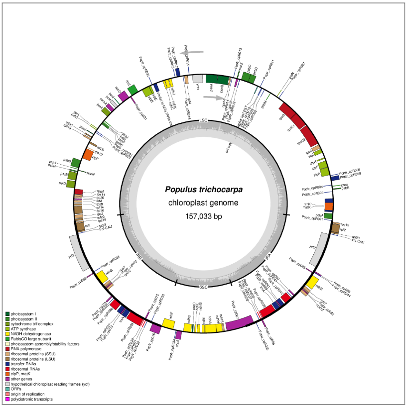

# Visualize Plastid Genome Structure

**Name:** Mary Rose V. Ferrer
**Course:** Cell and Molecular Biology, B

## Genome Information
| Item | Value |
|---|---|
| Scientific name | *Populus trichocarpa* (black cottonwood) |
| Family | Salicaceae |
| NCBI accession | NC_009143.1 (RefSeq) |
| Plastid genome length | 157,033 bp (circular) |
| Source of genome file | NCBI Nucleotide, record "Populus trichocarpa chloroplast, complete genome", downloaded in GenBank (full) format: https://www.ncbi.nlm.nih.gov/nuccore/NC_009143.1 |
| Original file | `data/Populus_trichocarpa_NC_009143.1.gb` (unchanged) |

This is the same plastid genome I used in the previous plastid genome activity.

## Software
OGDRAW (OrganellarGenomeDRAW), CHLOROBOX, Max Planck Institute of Molecular Plant Physiology: https://chlorobox.mpimp-golm.mpg.de/OGDraw.html
Reference: Greiner S, Lehwark P, Bock R. 2019. OrganellarGenomeDRAW (OGDRAW) version 1.3.1. Nucleic Acids Research 47: W59-W64.

## OGDRAW Settings Used
- Standard map mode
- Uploaded the annotated GenBank file
- Map type: Circular
- Sequence source: Plastid
- Inverted repeats: automatic detection
- GC content graph: drawn
- Direction of transcription: shown
- Legend: full legend
- Intron-containing genes marked with an asterisk: [CHECK: selected / not available]
- Output format: PNG

## Plastid Genome Map

## Answers
- answers to Questions 1-10 ([view answers](Answers/Lab_plastid_genome_answers.md))
